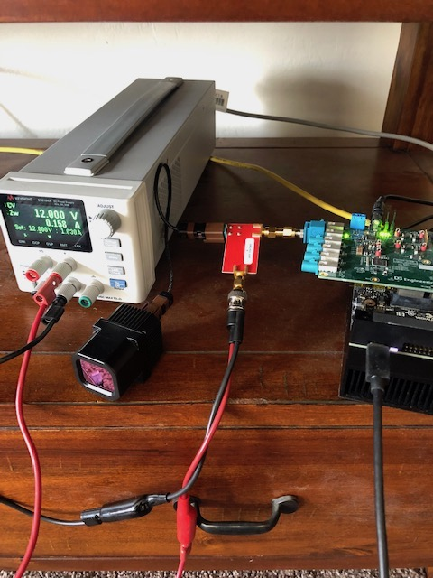

# Boson Heater Test Application

## About

This is an application for testing GMSL Boson image quality and whether the heater is functioning properly. This is intended to be used on the Nvidia AGX Xavier platform with a D3 SerDes GMSL2 adapter board.

## Setup 

When connecting a camera, you must connect the GMSL2 camera to a power injector, which must be connected to a power supply. 

Plug the other end of the power injector to the fifth GMSL2 port on the D3 SerDes board. Apply 12 volts to the power supply.

## Usage

To use the application, run `main.py` from command line. Or, if Michael or Yves are reading this and using the AGX unit on which this application was developed, then just double click the `Heater Test` application on the Desktop. 

Unfortunately every time you connect a new camera, you must restart the computer - the Boson driver cannot detect when a new camera has been connected.

When saving an image, the image gets saved to the desktop with the name matching the part number input into the text box i.e. 20007-12345 -> ~/Desktop/20007-12345.png. Checking the 'Overlay' checkbox enables/disables saving the image with the part number overlaid the image.

## Troubleshooting/Questions

This is a first release, so I have no troubleshooting guidelines yet. If you run into issues, please contact me (Anil Dhurjaty - adhurjaty@novacoast.com).

