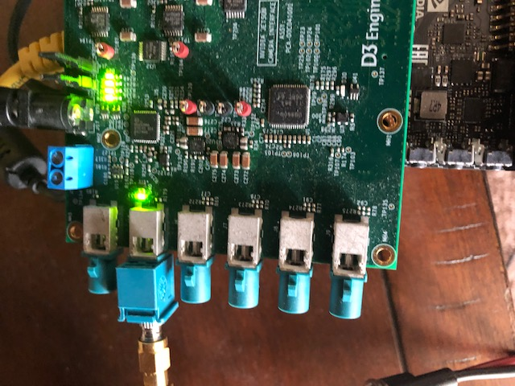

# Boson Heater Test Application

## About

This is an application for testing GMSL Boson image quality and whether the heater is functioning properly. This is intended to be used on the Nvidia AGX Xavier platform with a D3 SerDes GMSL2 adapter board.

## Installation
Clone this repo and change to this directory
From the command line, enter:
```sh
git clone git@github.com:FLIR/Xavier_Heater_Test.git
cd Xavier_Heater_Test
```
### Installing Python
```sh
sudo apt-get update
sudo apt-get install python3 python3-pip
```
### Installing Dependencies
```sh
sudo apt-get install python3-opencv pkg-config python3-setuptools
pip3 install -r requirements.txt
```
Ensure that the dependencies installed properly
```sh
python3
```
```python
>> import cv
>> import numpy
```
if you did not get errors, the packages were installed properly

### Grant Execute Permission

```sh
chmod +x main.py
```

## Pysical Setup 

Plug the camera into the fifth GMSL2 port on the D3 SerDes board as shown. You must connect the camera before turning the Xavier on - otherwise the operating system will not detect it.



## Usage

To use the application, run `main.py` from command line. 

When saving an image, the image gets saved to the desktop with the name matching the part number input into the text box i.e. 20007-12345 -> ~/Desktop/20007-12345.png. Checking the 'Overlay' checkbox enables/disables saving the image with the part number overlaid the image.

